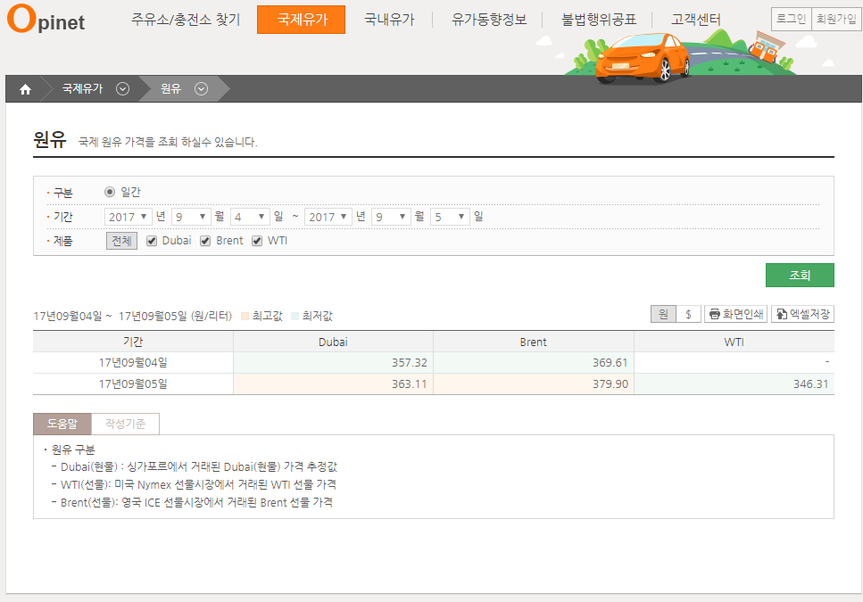

# 무역협회 실시간환율정보 수집

## 1. 수집정의
### 1.1 수집 데이터
- 실시간환율정보
- 화면

### 1.2 수집 기간
- 하루간격
## 2. 코드
```python
import pandas as pd
import requests
import time
import re
from bs4 import BeautifulSoup
from datetime import date,datetime,timedelta
from sqlalchemy import create_engine

params = {
    'user': 'xx@xx-db',
    'pass': 'xxxx',
    'host': 'xxxx-db.mysql.database.azure.com',
    'port': '3306',
    'schema': 'xxx_db_name?charset=utf8',
}
engine = create_engine('mysql+mysqldb://{user}:{pass}@{host}:{port}/{schema}'.format(**params), echo=False)

today = date.today()
crwaling_day = '2017-09-01' # ****-**-** format
temp = crwaling_day.split('-')

url = 'http://www.opinet.co.kr/glopcoilSelect.do?TERM=D&STA_Y={0}&STA_M={1}&STA_D={2}&END_Y={0}&END_M={1}&END_D={2}&OILSRTCD1=001&OILSRTCD2=002&OILSRTCD3=003'.format(*temp)
html = requests.get(url)
print(html.status_code)
html = html.text
soup = BeautifulSoup(html, 'html.parser')    

col_name = []
for temp in soup.select('.tbl_type10 th'):
    col_name.append(temp.text.strip())

print(col_name)
col_name = [w.lower() for w in col_name]
col_name[0] = 'base_date'
print(col_name)

value = []
for temp in soup.select('#tbody2 tr td'):
    value.append(temp.text.strip())
value = [w.replace('-', '0') for w in value ]
print(value)

if value == ['조회결과가 없습니다.']:
    import sys
    sys.exit()
else:
    temp = re.findall('[0-9]{2}', value[0])
    temp = '20'+'-'.join(item for item in temp)
    value[0] = temp
    df = pd.DataFrame(data=[value], columns=col_name).fillna('')
    df.insert(4,'last_update',today)

    pd.read_sql('DELETE FROM tb_oil_price where base_date= %s',con=engine,params=[crwaling_day],chunksize=0)
    df.to_sql('tb_oil_price',con=engine, if_exists='append', index=False)

    print('{} 크롤링 완료\n'.format(crwaling_day))
```

## 총평
> 1. list comprehension 좋네, R에 sapply를 for로 처리하는 느낌