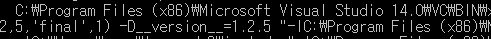
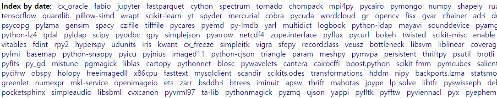
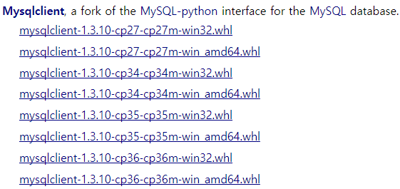

TOC

에러명|해결방법|상세보기
:---:|:---:|:---:
build/compile|소스코드 파일을 기계어(binary)로 변환|[link](#build/compile)

### build/compile

- 에러

> 이런거 나오면 다 빌드에러

- 원인

라이브러리를 compile/build 한후에 올리는 경우랑 하지않은채로 올리는 경우에 저러한 에러남, 리눅스같은 경우는 알아서 처리해주는데 윈도우는 처리 잘 안됨

> 사실 제대로 모르겠음

- 해결방법

1. `python windows binary` 검색

2. `Index by date`에서 원하는 라이브러리 찾기

3. python version + 윈도우 버전 확인 후 다운로드

4. 다운로드 경로에서 `pip install mysqlclient-1.3.10-cp36-cp36m-win_amd64.whl` 입력

## build