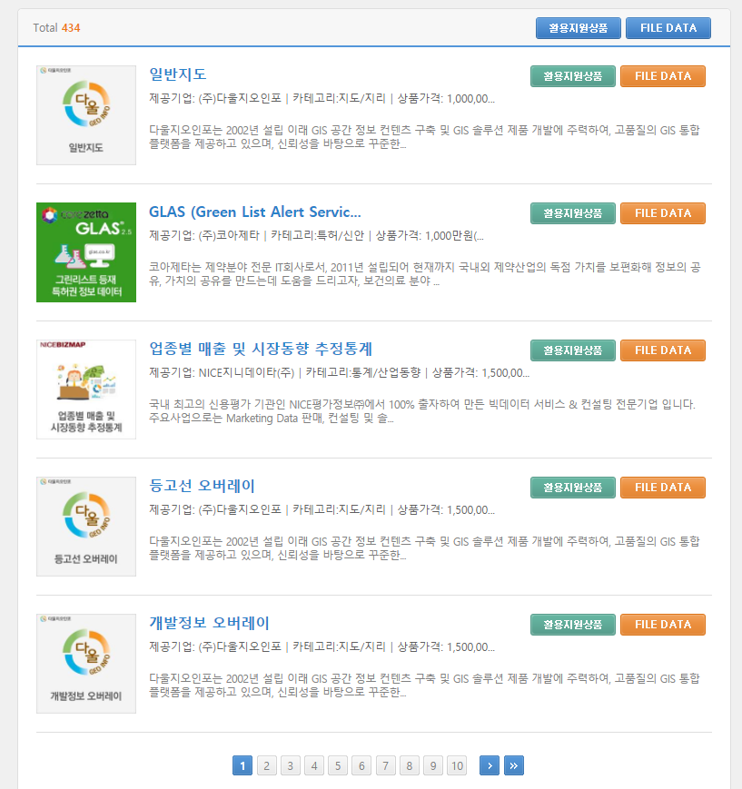
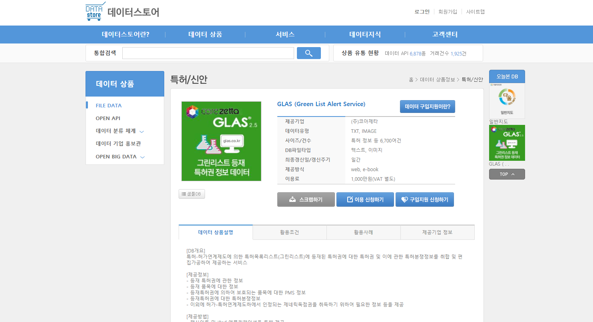

# 데이터 스토어 File Data 수집
## 1. 수집정의
### 1.1 수집 데이터
- 데이터 스토어 내의 제공 데이터 상세정보(*제조기업, 데이터유형 등*)

데이터 목록


데이터 상세정보


### 1.2 수집 기간
- 일회성

## 2. 코드

```r
####데이터 스토어 File Data 수집####
library(httr)
library(rvest)

list.url = 'https://www.datastore.or.kr/product/fileDatalist.do?page=1' #게시판 URL
dataset = c()
for(i in 1:87){
  url = modify_url(list.url, query=list(page=i))  # 게시판 URL에서 페이지를 변경
  h.list=read_html(url, encoding = "UTF-8") #게시물 목록 가져옴 #encoding 요소검사해서 위로 쭉 가면 나옴
  title.links = html_nodes(h.list, '.data_con h5 a') #게시판 게시물 별 링크 따기 위해서 필요
  article.links = html_attr(title.links, 'href') #게시물 별 링크 추추

  for(j in 1:length(article.links)){
    link = paste0("http://datastore.or.kr", article.links[j])  # 게시물 주소 앞에 네이버 주소를 붙임
    all_text=readLines(link,encoding = "UTF-8") #read_html 인코딩 문제가 많네 그냥 readLines로 읽자
    new_all_text=gsub(".*<td>|</td>.*", "",all_text[grep(x=all_text,pattern = "<td>(.*)</td>")]) # 태그 안에 이런 패턴애들 다 가져와
    src_title <- read_html(link)%>% #title 가져오기
      html_nodes("h4")%>%
      html_text()
    title <- gsub("\t|\r|\n", "",src_title)
    new_all_text=c(title,new_all_text)
    dataset=rbind(dataset,new_all_text)
  }
  Sys.sleep(2)
}
colnames(dataset)<-c("상품명","제공기업","데이터유형","사이즈/건수","DB파일타입","최종갱신일/갱신주기","제공방식","이용료")
rownames(dataset)<- NULL
write.csv(dataset,"C:/Users/warm/Desktop/data.csv")
```

## 총평
> 1. `read_html("url주소") -> html_nodes("table있는 클래스명")%>%html_table()` 일케 하면 될 거... 한글 문제로 길어졌네 `readLines`로 해결함 2. 정규식 공부해야겠다.
