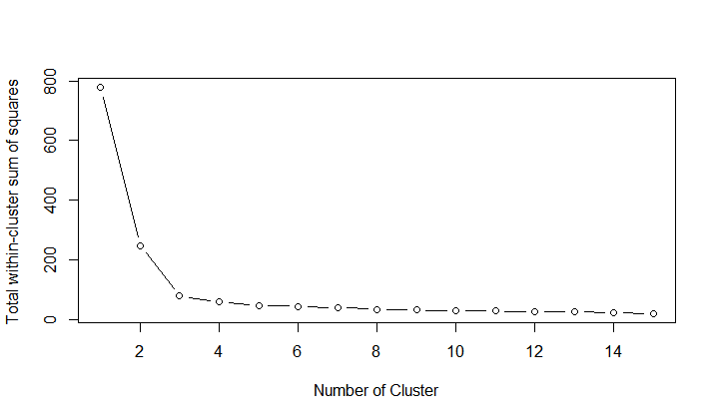

# 적절한 군집 개수 찾기
(find appropriate number of clusters)

> ### SSE를 이용하자

#### 데이터 불러오기
```r
train_iris = iris[, -5]
head(train_iris)
```
```
##   Sepal.Length Sepal.Width Petal.Length Petal.Width
## 1          5.1         3.5          1.4         0.2
## 2          4.9         3.0          1.4         0.2
## 3          4.7         3.2          1.3         0.2
## 4          4.6         3.1          1.5         0.2
## 5          5.0         3.6          1.4         0.2
## 6          5.4         3.9          1.7         0.4
```
#### 사용자 함수
```r
total_within_cluster_sum_of_squares <- function(data, number_of_cluster=15, seed=1111){
  wss <- (nrow(data)-1)*sum(sapply(data,var)) # 전체 데이터 SSE(i.e. 군집은 하나)
  # plot그렸을 때, 첫번째 오는 수치
  for (i in 2:number_of_cluster){
    set.seed(seed)
    wss[i] <- kmeans(train_iris, centers = i)$tot.withinss}
  plot(1:number_of_cluster, wss, type = "b",
       xlab = "Number of Clusters", ylab = "Total within-cluster sum of squares ")
  }

total_within_cluster_sum_of_squares(train_iris)
```
<p align="center">
  
</p>

> 2~3개가 적당하네
