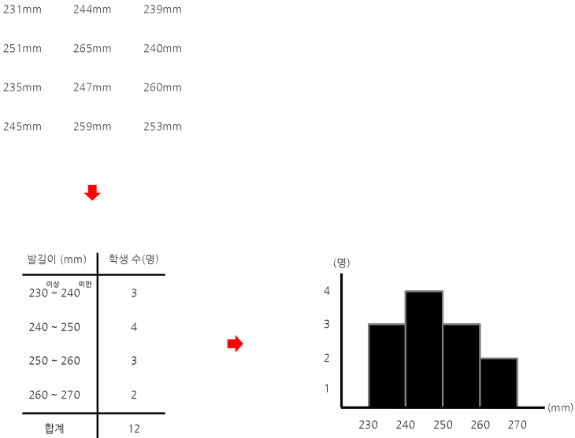
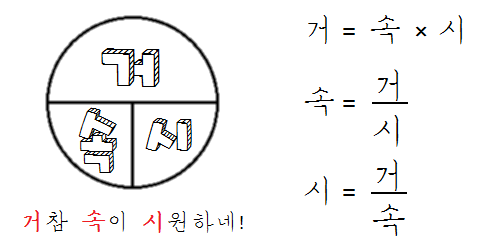

# 통계
통계는 두 분야가 있다.
1. 기술 통계: 데이터의 특징을 뽑아내는 통계
2. 추리 통계: 부분으로 전체를 추측하는 통계

> "왜 통계를 사용할까?"

-> 데이터 자체로는 아무것도 알 수 없기 때문에 통계를 사용

# 통계량

- 데이터의 특징을 알려주는 숫자를 통계량이라 부른다
- 도수분포표, 히스토그램, 평균, 중앙값 등

> "소설을 다 읽을 필요없이 요점을 전달해주는 것"

### 히스토그램
histogram
> "데이터의 특징을 히스토그램으로 전달해보자"

`데이터` -> `도수분포표` ->  `히스토그램`

### 평균값
> 지렛대의 균형 지점

> "평균을 구하는 방법은 여러가지"

- 산술평균: 덧셈의 의미로 본질을 유지
- 기하평균: 성장률 등을 다루면서 곱셈의 의미로 본질을 유지
- 조화평균: 속도를 다룸

### 1.1 산술평균
합계를 총 개수로 나누기
`공식` = `(x+y)/2`

data: 1 2 3

산술평균 (1+2+3)/3 = 2

### 1.1 기하평균/상승평균
- 연간 경제성장률, 물가인상율, 연간 이자율, 크기 확대 비율 같이 표본들이 비율이나 배수이고 각 표본값이 연속성이 있어서 표본들을 곱한 값이 의미가 있는 경우에 주로 쓰인다.

`공식` = 

### 문제.
1. 한 기업의 어느 해 매출이 50% 성장했고 다음 해에는 4% 감소했을 때, 2년 연속 몇 %씩 성장했는가?

### 풀이.

-> 2년 연속 20%씩 성장

2. 매출은 2년 후 얼마나 증가했을까?

위에서 구한 20%씩 곱해줘도 되지만,
(1.2 x 1.2 = 1.44 -> 매출의 1.44배)

성장률 구할 때 바로 구한
(1.5 x 0.96 = 1.44배)를 사용하자.

### 문제.
매출이 작년에 1.5배로 증가하고 올해 6배로 증가했다면 매년 평균 몇 배 증가?
### 풀이.

-> 3배 증가

### 1.3 조화평균

`공식` = 

### 문제.
갈 때는 시속 x km로, 돌아올 때는 시속 y km로 이동했다면, 평균시속은? (편도 1km)

### 풀이.
`시간 공식` = 

갈 때 드는 시간은 1/x, 돌아올 때 드는 시간은 1/y
, 왕복 2km

-> 

---

# 편차

아래와 같은 연봉테이블이 있다. 이 기업의 연봉이 높다고 볼 수 있을까?

직원|연봉(천)
:---:|:---:
사원|1
사원|1
임원|13
**합계**|15
**평균**|5

평균 5천만원을 받구나~! 라고 생각하면 안된다.
임원의 급여로 평균을 높인다. 불평등한 연봉이다.

> *따라서*, **평균만 가지고 데이터를 파악하기 힘들다.**

이를 판단하기 위해 편차를 사용한다.

`편차 = 평균 - 데이터값`

직원|연봉(천)|편차
:---:|:---:|:---:
사원|1|-4
사원|1|-4
임원|13|+8
**합계**|15|0

편차를 다 더해보면 0 이 나온다. 뭔가 데이터 특성을 대표할 수 있는 수치가 없을까?

> 분산이란 놈이 있다.

# 분산
(Variance)
편차 제곱 합의 평균
- 데이터가 퍼져 있는 상태를 평가할 수 있음

직원|연봉(천)|편차|편차 제곱
:---:|:---:|:---:|:---:
사원|1|-4|16
사원|1|-4|16
임원|13|+8|64
**합계**|15|0|96
**전체표본 수**|3명|**평균**|96/3=**32**

근데 문제가 있음.
1. 흩어져 있는 상태를 나타내기에는 수치가 너무 큼
2. 단위가 바뀜(연봉(천) 단위에서 천의 제곱단위가 되어버림)->해석 어려움

이 문제를 다 해결하는 놈은 없을까?

> 표준편차라는 놈이 있다.

# 표준편차
(standard deviation)

데이터가 평균 주변에 얼마나 퍼져 있나? 는 분산이랑 개념이 똑같음

하지만 앞의 두 가지 문제점을 해결함

표준편차 = 분산에 루트 =
 = 약5.65

평균에서5천에서 실제 약 +5천 6백만원 , -5천 6백만원 정도 다를 수 있음.

> 표준편차를 통해서 데이터가 평균에서 실제 많이 떨어질 수 있다는 것을 알 수 있다.

표준편차로 또 무엇을 할 수 있을까?

> 표준편차로 그룹간의 비교를 할 수 있다.

예를 들어, A학급 B학급이 있는데 둘다 성적 평균이 80점이다.
선생님의 수업 우수성을 학급의 대부분의 학생들이 많은 편차(0점인 학생, 100점인 학생 같은...)를 가지지 않음으로 판단한다고 했을 때, A학급의 표준편차는 10점, B학급의 표준편차는 30점이 나왔다. 이럴 때 A학급의 선생님이 B학급의 선생님보다 수업 우수성이 탁월하다고 말할 수 있다. 부진학생이 많이 없으니깐!

---

# 독립변수와 종속변수
독립변수: 원인이 되는 변수, 설명변수
(Independent variable)
종속변수: 결과가 되는 변수, 반응변수
(Dependent variable)

# 가. 자료의 분류

############ ###########

범주형
(Categorical data, Qualitative data)
명목척도, 순위척도
(nominal scale), (ordinal scale-학년,등급)
연속형
(numerical data, Quantitative data)
간격척도, 비율척도 <- 얘 둘의 차이는 절대영점(=존재하지 않는다, 비타민 0mg->비타민이 존재하지 않는다.)의 존재
interval scale(온도), ratio scale(키, 체중, 비타민)
############ 닥터 베베 그림 넣자 ###########

# 나.

귀무가설
Null hypothesis, H0 : 차이가 없다.

대립가설
Alternative hypothesis, H1 : 차이가 있다.
연구자가 주장하고자 하는 가설

p<0.05 -> 귀무가설이 될 확률은 5% 미만 -> 매우 희박
-> 대립가설 채택

예제
A치료법, B치료법
H0, 두 치료법에 차이가 없다 -> p<0.05 -> 차이가 없을 확률은 5%미만
-> 매우 희박하니 두 치료법에는 차이가 있다. H1 채택

# 다.
5% 유의수준과 다중비교

참조 :
1. 세상에서 가장 쉬운 통계학 입문
2. 빅데이터를 지배하는 통계의 힘
3. 닥터 배의 술술 보건의학통계
