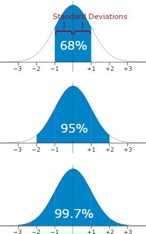

# 표준정규분포
> 데이터 분포를 알면 수학적으로 데이터 수치를 계산할 수 있다.
가장 기초가 되는 표준정규분포를 배워보자

### 성질

1. 평균 = 0, 표준편차 = 1
2. +1, -1 범위(평균에서 표준편차 1배 이내 범위의 데이터)의 상대도수는 0.68
2. +2, -2 범위(평균에서 표준편차 2배 이내 범위의 데이터)의 상대도수는 0.9544

`해석`:

표준정규분포에서는,
1. 표준편차 2배 범위 이내에 대부분의(95%) 데이터가 들어간다.
2. -1, +1 이하의 수를 예측할 확률은 68% 이다.
3. -2, +2 이하의 수를 예측할 확률은 95.44% 이다. 4.56%의 예측은 틀릴 확률이다.
4. -무한대, +무한대를 예측할 확률은 100% 이다.

통계학에서는 -2, +2 이하의 수를 예측할 확률은 95.44% 이다. -> 남은 0.44% 떼어 버리기 위해서 구간을 -1.96, +1.96 범위를 95% 예측 구간이라 약속했다.

# 일반정규분포

- 데이터의 일반적인 정규분포

### 문제.1

- 시험 성적

평균이 50점 나는 60점을 받았다. 두 가지 상황에 대한 해석은? 어느 상황이 더 잘했다고 칭찬 받을 수 있을까?

A. 표준편차가 10점 -> 나와 같은 점수를 받은 사람이 많다. -> 대부분이 평균 근처에 없다. -> "오 잘했어"

B. 표준편차가 1점 -> 나와 같은 점수를 받은 사람이 적다. -> 대부분이 평균 근처에 있다. -> "쏘쏘"

수학적으로 해보자

### 풀이.1

`공식` z=평균값에서 표준편차의 몇 배 정도 떨어져 있다 = (데이터 값 - 평균) / 표준편차

A. (60-50)/10 = 1 -> 데이터의 위치가 +1, -1만큼 들어갈 확률이 68%안에 들어감 -> 평범하게 일어난다.

B. (60-50)1 = 10 -> 데이터의 위치가 +10, -10만큼 들어갈 확률이 99.7%안에 들어감 -> 엄청 특수한 경우다.

보통 2이상이면 특수하다고 말한다.

### 문제.2

남성의 소득 평균이 약 300만원, 표준편차는 100만원인 정규분포라고 알려져 있다. 특정 남성의 소득을 예측한다고 할 때, 95%의 예측률을 가지려면 어느 범위를 예측해야 할까?

> 표준정규분포를 이용해보자.

> 근데 실제 데이터에서 평균이 0 이고 표준편차가 1인 게 없잖아! 그래서 표준정규분포로 바꿔줘야함

일반정규분포를 표준정규분포로 바꿔서 표준정규분포의 성질을 이용

개념도

`공식`

### 풀이.2

따라서 104만원 이상 396만원 이하라고 예측하면 됨.

그러면 95%의 예측률을 가지게 된다.
