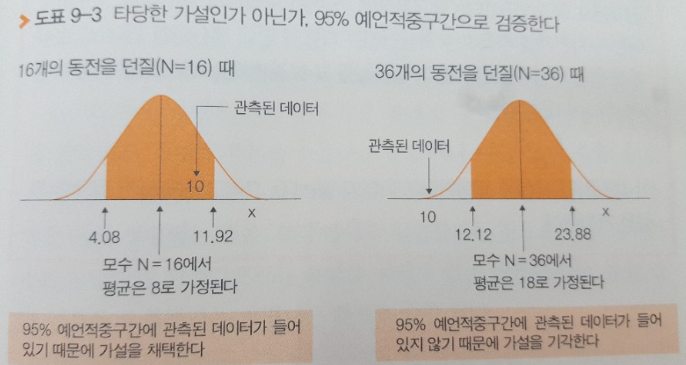

# 가설검정

관측된 모든 데이터를 모집단이라 부름

통계적 추정은 모집단에서 몇 개의 데이터를 관측하는 것부터 출발
관측한 것으로부터 모집단에 대해서 무엇을 추측할 수 있을까?
부분으로 전체(모집단)을 추측하는 것을 통계적 추정(귀납적 추론)이라 함

- 종류: 점추정, 구간 추정

> "파스타 한 젓가락 먹어보고 맛있다고 판단", "다 먹어보고 판단하지 않는다"

case.선거 출구조사
우리나라 전체인구에 대한 조사가 아닌 몇 퍼센트의 사람을 관측한 후
전체인구(모집단)의 선거 결과를 예측한다.

통계적 추정을 대표할 수 있는 것을 `검정`이라 부름

예상하는 모집단의 종류를 `모수(parameter)`라 부름

> # 모수 잘 이해안감

> 이미 관측된 전체 데이터나 집단을 모집단으로 부르고, 실제로 얼마인지 모르는 추정 수치를 모수라 부르는 듯, 예를 들어 모집단은 동전의 개수(1~무한대)인데 그 집합안에 가상의 모집단의 개수를 10이라치면 그것은 모집단안에 들어가는 개수이고 이걸 모수라 함

모수 N의 경우, 타당한 수치를 어디까지 허용할 수 있을까?
통계학에서는 95% 예측적중구간을 사용한다.

# 점추정

### 문제
16개 동전을 던져서 앞면이 나오는 개수를 예측할 때, 10개라고 예측할 때 타당한가? 12개라고 예측할 때 타당한가?

### 풀이
통계학에서는 95% 예측적중구간을 사용한다. 동전은 평균값 뮤=n/2이니깐 16/2 =8, 표준편차 시그마= 루트N/2=루트16/2=2인 정규분포라 생각할 수 있다. *(참고. 평균값, 표준편차 구하기(동전)
)* 정규분포의 성질에 따라 95% 예측 구간의 부등식 표시는 -1.96 < x-8/2 < 1.96*(참고. 표준정규분포의 성질)*
이를 풀면
4.08 < x <11.92

즉, 10개를 예측할 때, 예측의 범위 안에 들어간다고 할 수 있다.
10개 예측은 옳다(통계학적으로)

현실에서 관측된 데이터 10은 예상할 수 있는 수치(95%예측적중구간 내)라 할 수 있다.
하지만 12는 현실에서 예상할 수 없는 수는 예상외의 수치(5%의 확률에서만 일어나는 희귀한 일)이다.

> ## 통계적 추정은 틀릴지도 모른다(희귀한 일이 발생할 지도 모른다)는 리스크(5%)를 각오하고 진행한 것

`모수 N의 경우, 타당한 수치를 어디까지 허용할 수 있을까?`

`95% 예측적중구간 내에 있다.`
-> 통계학 용어로 '가설을 채택한다'

`95% 예측적중구간범위를 넘어섰다(5%리스크)`
-> 통계학 용어로 `가설을 기각한다`

# 정리
통계적 추정을 하기위한 가설이 채택이냐 기각이냐를 판단(타당성)하는 방법을 가설검정이라 할 수 있다.

---

# 구간추정

### 문제
N개의 동전을 던지는 실험을 하여 앞면이 10개 나왔다는 결과만을 알고 있다고 하면, 던진 개수를 N이라고 생각할 수 있는 것은 몇 개에서 몇 개까지 일까?

### 풀이

> 전체 N에 대한 z값을 구해보자

p.125 표

N의 95% 신뢰구간은 13 < N <30

있을 수 있는 모수가 들어있는 구간을 95% 신뢰구간이라하며 모수를 이러한 구간에서 추정하는 것을 `구간추정`이라 한다.

# `95% 신뢰구간` 과 `95% 예측적중구간`의 의미는 완전히 다른 것

`95% 예측적중구간` 은
- 95%의 데이터 그 구간에 들어가 있다.
- 다음 관측하는 데이터는 95%확률로 그 구간에 들어간다

`95% 신뢰구간` 은
- 관측값 x가 나온 경우에 N을 추정해 가는 과정을 반복한다면, 그 중 95%의 추정 결과가 맞는다는 것
- 예를 들어 앞면이 나온 개수가 10개로 관측될 때, 모수 N의 95% 신뢰구간이 13<x<30이라면 정말 N으로 가능한 것이 95%로 들어간다. 는 것이 아니라,
- 구간추정을 계속 실행하면, 관측값에 대응하는 여러 구간(10개일 땐 13<x<30,11개일 땐 ?<x<?, ...)을 구할 수 있지만, 그 100번 중 95번은 N이 구해지는 구간에 들어간다.

> # `95% 신뢰구간` 은 구간 추정 100번 중 95번이 맞는다는 거, 5%는 구간 추정한 게 틀릴 수도 있다는 말
앞의 결과 13<x<30일 때, 14가 95%확률로 그 구간으로 들어간다는 게 아니라, 추정 구간(13<x<30)이 95%확률로 바른 모수를 포함 할 수 있다.

# 정리
`95% 예측적중구간`

실제로 데이터가 나타날 확률은 95%

`95% 신뢰구간`

추정구간(?<x<?)이 95%확률로 맞는다는 말
