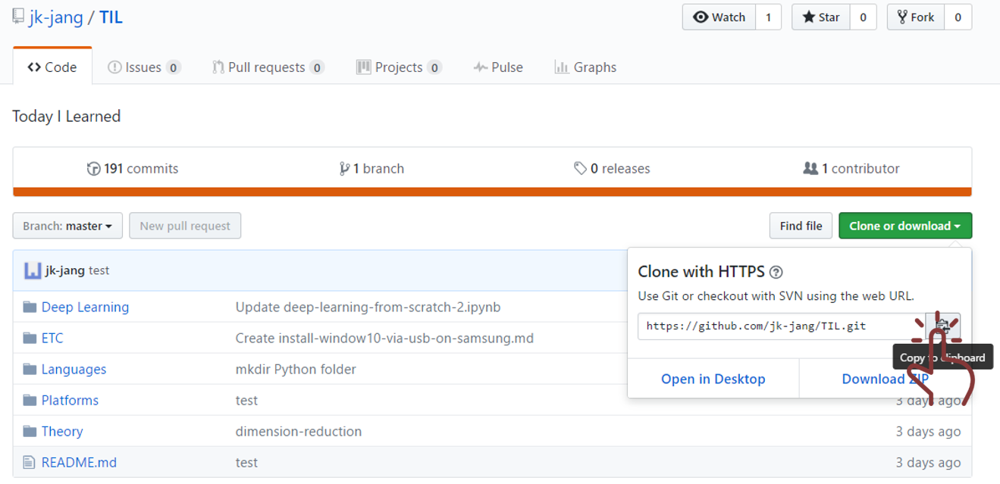
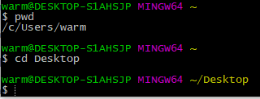
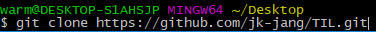
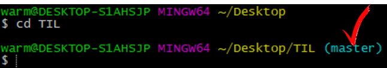
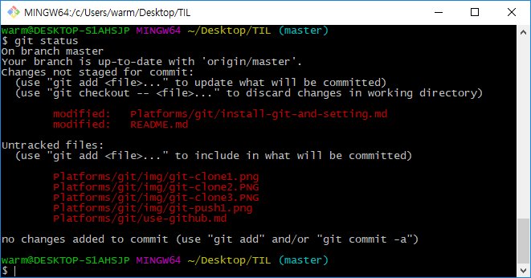
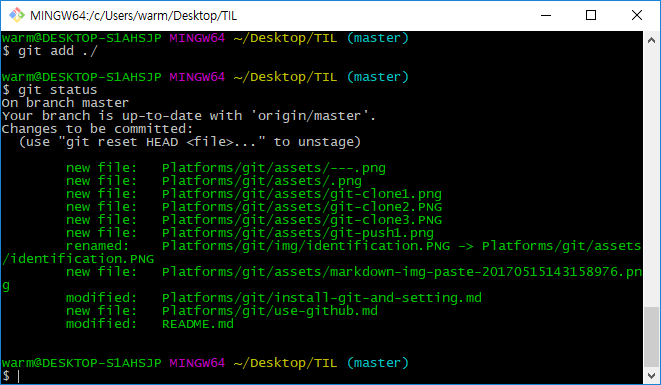
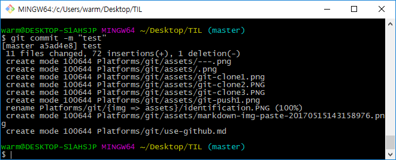
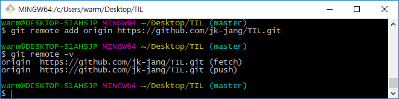
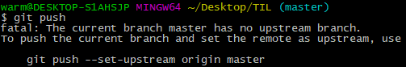
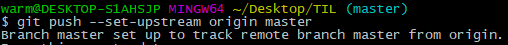

# Github
온라인 저장소

## requirements
- Git
- Sign up for Github
- Create Github Repository

# Clone a repository

> "내 컴에 가져오기"

1. 주소 복사

2. 설치할 경로 설정
 `Git Bash`열기

> "난 desktop에 설치할거야"

3. `주소` 붙여넣기

---

# Push & Pull
Push : 변화된 것을 git에다가 반영해줘

Pull : 변화된 것을 desktop에 가져와줘
## 1. Push
> "Git을 쓰기위해서느 변화가 필요하다. 바탕화면에 설치된 repository에 변화를 주자!"

> "코드를 좀 바꿨다"

`Git Bash`

### 경로 설정

> "master로 뜸"

### 변화 확인하기

`git status`

> "빨간 애들은 해당 파일이 변화가 있었다를 뜻함"

### git에 반영하기 (add -> commit -> push)
step 1.(**add** -> commit -> push)
`git add ./` `git stauts`

 > "얘들 변화를 반영해줘"

 > "초록 애들은 변화가 반영되었음을 뜻함"

step 2.(add -> **commit** -> push)
`git commit -m "테스트"`

> "반영되었고 이렇게 바꼈어."

step 2-0. remote(원격) 설정
> "아랫 부분 한 번만 해주면 된다."

---
1. `git remote add 별명 주소`

2. `git push`

> "upstream 정해주면 git push 명령어로만 된다고 한다."

3. identification

---
step 3. (add -> commit -> **push**)

`git push`

---
## 2. Pull
이 컴 저 컴에서 git사용한 경우 최신버전을 반영하기 위해서 작업하기 전에 git pull부터 해야한다.

`git pull`

> "전체적으로 좀 불편한 듯 편한게 없을까?"

cf. [Other way](./use-git-in-atom.md)
