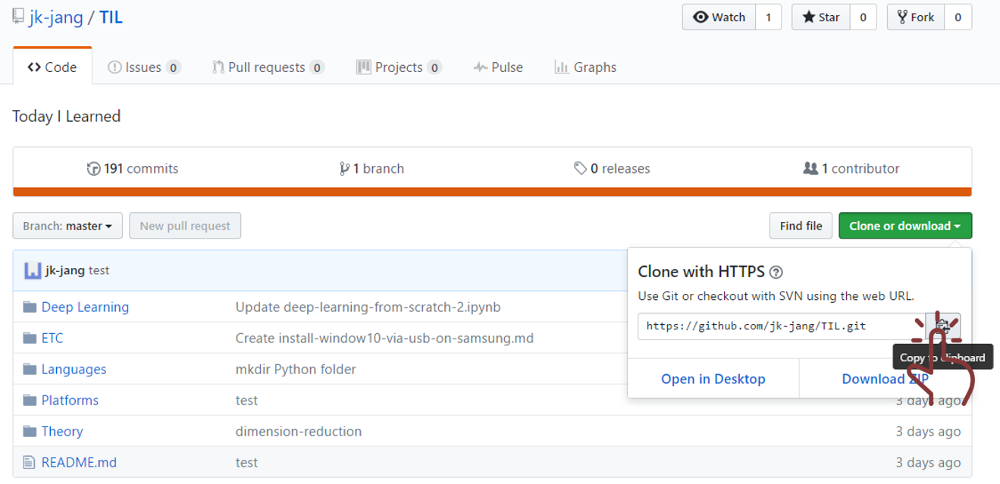

# Github
온라인 저장소

## requirements
- Git
- Sign up for Github
- Create Github Repository

# Clone a repository

> "내 컴에 가져오기"

1. 주소 복사

2. 설치할 경로 설정
 `Git Bash`열기

> "난 desktop에 설치할거야"

3. `주소` 붙여넣기

---

# Push & Pull
> "Git을 쓰기위해서느 변화가 필요하다. 바탕화면에 설치된 repository에 변화를 주자!"

> "코드를 좀 바꿨다"

`Git Bash`

> "master로 뜸"

git status

git add commit push
git pull

> "좀 불편한 듯 편한게 없을까?"

- Github Gui(Github desktop version, etc)
- Editor + package

> "2번째 방법이 더 익숙하네"

# Push & Pull atom version
## install 'git-plus' package
<kbd>File</kbd> -> <kbd>Settings</kbd> -> <kbd>install</kbd> -> <kbd>git-plus</kbd>

## use 'git-plus'
검색창 키기
 
<kbd>Ctrl</kbd> + <kbd> Shift</kbd> + <kbd> p </kbd>

검색창에 `git acp`
