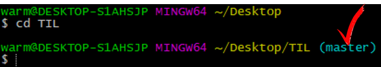

# Github
온라인 저장소

## requirements
- Git
- Sign up for Github
- Create Github Repository

# Clone a repository

> "내 컴에 가져오기"

1. 주소 복사

2. 설치할 경로 설정
 `Git Bash`열기

> "난 desktop에 설치할거야"

3. `주소` 붙여넣기

---

# Push & Pull
> "Git을 쓰기위해서느 변화가 필요하다. 바탕화면에 설치된 repository에 변화를 주자!"

> "코드를 좀 바꿨다"

`Git Bash`

### 경로 설정

> "master로 뜸"

### 변화 확인하기

`git status`

> "빨간 애들은 해당 파일이 변화가 있었다를 뜻함"

### git에 반영하기 (add -> commit -> push)
step 1.
`git add ./` `git stauts`

 > "얘들 변화를 반영해줘"

 > "초록 애들은 변화가 반영되었음을 뜻함"

step 2.
`git commit -m "테스트"`

> "반영되었고 이렇게 바꼈어."

step 2-0. remote(원격) 설정
> "한 번만 해주면 된다."

'git remote add 별명 주소'

`git push`

`git pull`

> "좀 불편한 듯 편한게 없을까?"

- Github Gui(Github desktop version, etc)
- Editor + package

> "2번째 방법이 더 익숙하네"

# Push & Pull atom version
## install 'git-plus' package
<kbd>File</kbd> -> <kbd>Settings</kbd> -> <kbd>install</kbd> -> <kbd>git-plus</kbd>

## use 'git-plus'
검색창 키기
 
<kbd>Ctrl</kbd> + <kbd> Shift</kbd> + <kbd> p </kbd>

검색창에 `git acp`
