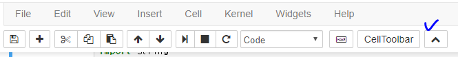
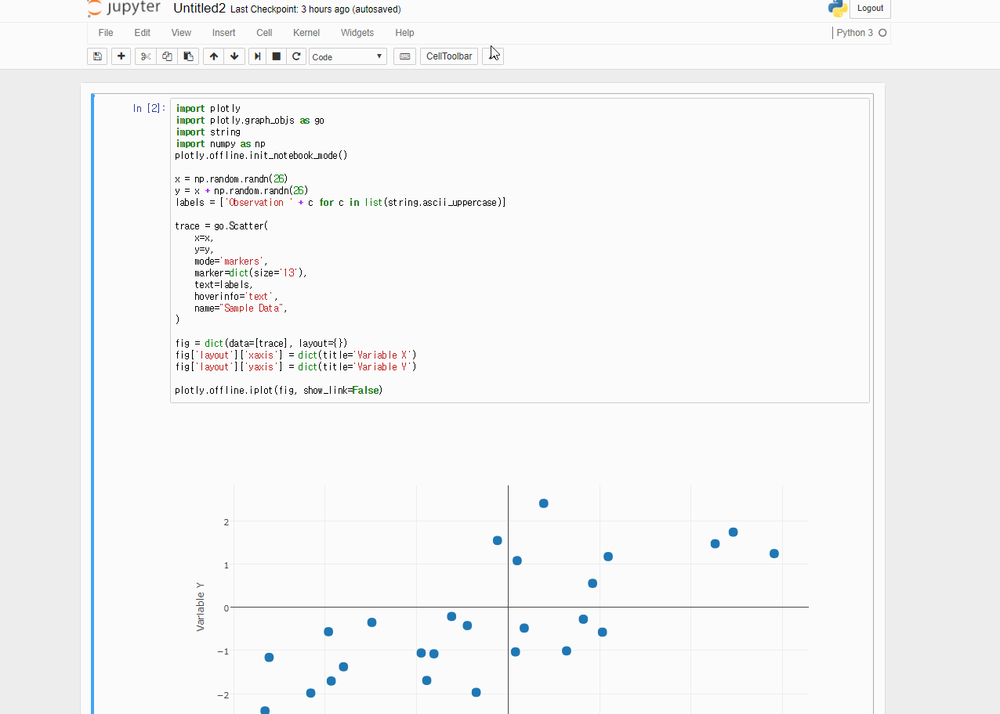
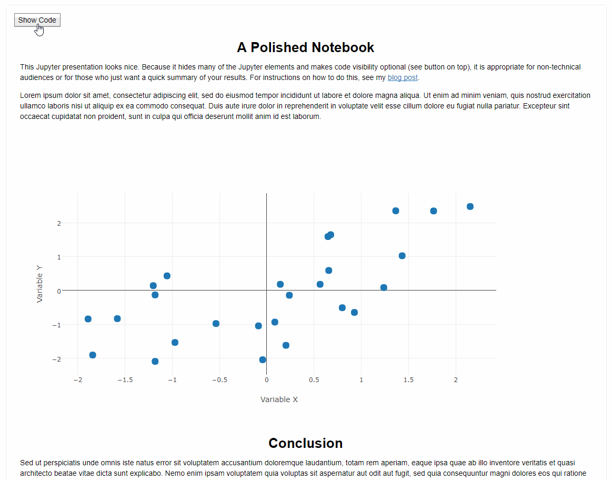

TOC

1. [nbextension-Hide input](#nbextension-hide-input)
2. [nbviewer](#nbviewer)

## nbextension-hide input
1. `hide input` Enable check

2. 노트북 화면에 아래 그림처럼 툴바 생김

- 실행 화면

> HTML로 저장하면 코드가 보임 

## nbviewer
[참고사이트](http://chris-said.io/2016/02/13/how-to-make-polished-jupyter-presentations-with-optional-code-visibility/)

1. Cell input 설정을 Raw NBConvert로 바꾸고

2. 사이트에 나와있는 코드 앞과 뒤에 입력하면 됨

- HTML로 저장한 화면

- [nbviewr.jupyter.org이용한 화면](http://nbviewer.jupyter.org/github/jk-jang/TIL/blob/master/Platforms/jupyter%20notebook/notebook_polished.ipynb)

