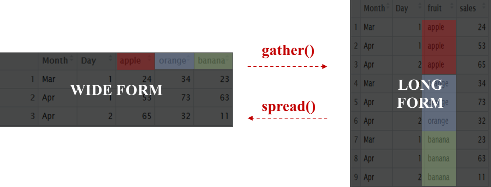

참고

`tidyr` vs `reshape2` vs `reshape`

> 해들리가 tidyr로 전부 대체

> 그냥 tidyr 쓰자

ref: https://github.com/tidyverse/tidyr


# gather()
## "wide form(옆으로 긴 거)을 long form(밑으로 긴 거)으로 바꿈"
> 변수명들을 범주들로 바꿈(변수명: apple, orange, banana을 한 변수의 범주로 들어감)


<p align="center">

</p>

## "알고 싶은 것!"

> 일자(`Month`, `Day`)에 따라 한 줄에 한 과일의 판매량을 알고싶어

### "아래 데이터를 예시처럼 ~ !"
과일 판매량

Month|Day|사과|오렌지|바나나
:---:|:---:|:---:|:---:|:---:
Mar|01|24|34|23 
Apr|01|53|73|63
Apr|02|65|32|11


예시
```
#   Month Day  fruit sales
# 1   Mar   1  apple    24
```


## 형식: gather(data, key, value, ...)
key: "기존 데이터의 변수명을 대표할 새로운 열의 이름"
> 기존 데이터의 변수에 사과, 오렌지, 바나나가 있었으면 열의 이름을 `fruit`으로 해주자

value: 기존 데이터값(cell)을 대표할 새로운 열의 이름",
> 기존 데이터값이 판매량을 뜻하면 `sales`라고 해주자

...: "Long form에서 제외할 변수 리스트 or -Long form에 포함할 변수 리스트")
> (`사과`:`바나나`) or (`-YEAR`, `-Month`)

```r
fruit <- data.frame(
  Month = c('Mar', rep('Apr',2)),
  Day   = c(01, 01, 02),
  apple  = c(24, 53, 65),
  orange    = c(34, 73, 32),
  banana= c(23, 63, 11)
)
fruit
#   Month Day apple orange banana
#    Mar   1    24     34     23
#    Apr   1    53     73     63
#    Apr   2    65     32     11
```
### 라이브러리
```r
require(dplyr, tidyr)
```
```r
fruit%>%
  gather(fruit, sales, -Month, -Day)

#    Month Day  fruit sales
# 1   Mar   1  apple    24
# 2   Apr   1  apple    53
# 3   Apr   2  apple    65
# 4   Mar   1 orange    34
```

## 문제.1
> 일자(Month, Day)에 따라 한 줄에 한 관측치의 값을 알고싶어

ex)밑에처럼 바꾸고 싶어~
```
##   Month Day quality value
## 1     5   1   Ozone    41
```
### 데이터 
```r
head(airquality)
#   Ozone Solar.R Wind Temp Month Day
# 1    41     190  7.4   67     5   1
# 2    36     118  8.0   72     5   2
# 3    12     149 12.6   74     5   3
# 4    18     313 11.5   62     5   4
# 5    NA      NA 14.3   56     5   5
# 6    28      NA 14.9   66     5   6
```
```r
airquality%>%
  gather(quality, value, -Month, -Day)%>%
  head()# Ozone:Temp라 해도 되는데 정렬이 저렇게 깔끔하게 된 경우 잘 없음
##   Month Day quality value
## 1     5   1   Ozone    41
## 2     5   2   Ozone    36
## 3     5   3   Ozone    12
## 4     5   4   Ozone    18
## 5     5   5   Ozone    NA
## 6     5   6   Ozone    28
```
## 문제.2
> 약 이름(name)에 따라 한 줄에 한 약품(a,b)의 값을 하나씩 알고싶어

ex)밑에처럼 바꾸고 싶어~
```
#   name drug heartrate
# Wilbur    a        67
````
### 데이터 
messy <- data.frame(
  name = c("Wilbur", "Petunia", "Gregory"),
  a = c(67, 80, 64),
  b = c(56, 90, 50)
)
messy
```
#      name  a  b
# 1  Wilbur 67 56
# 2 Petunia 80 90
# 3 Gregory 64 50
```
```r
messy %>%
  gather(drug, heartrate,-name)
#      name drug heartrate
# 1  Wilbur    a        67
# 2 Petunia    a        80
# 3 Gregory    a        64
# 4  Wilbur    b        56
# 5 Petunia    b        90
# 6 Gregory    b        50
```

ref: 
https://blog.rstudio.org/2014/07/22/introducing-tidyr/
http://mathpsy.tistory.com/20

